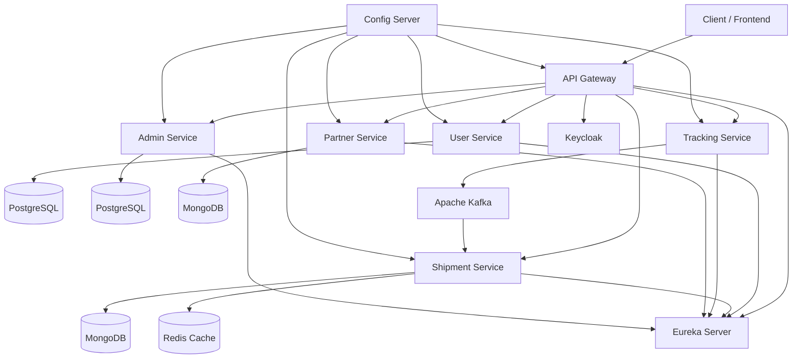

# TrackMate

TrackMate is a logistics and shipment tracking system developed using Spring Boot microservices architecture. It provides features such as user management, shipment creation, real-time tracking, secure authentication and authorization using Keycloak, API Gateway, service discovery with Eureka, centralized configuration, and asynchronous communication using Kafka.
## Features
- Secure authentication and authorization using Keycloak and JWT
- API Gateway for centralized routing, security, and request filtering
- Service Discovery using Eureka Server
- Centralized configuration using Config Server
- Shipment creation and management
- Real-time shipment tracking
- User and partner management
- Caching using Redis
- Event-driven communication using Spring Cloud Stream and Apache Kafka
- Asynchronous messaging using Kafka
- Inter-service communication using OpenFeign and WebClient
- Role-based access control (Admin, Partner, User)

## Architecture Highlights
- Microservices architecture with Spring Boot
- API Gateway for centralized routing and security
- Event-driven architecture using Kafka and Spring Cloud Stream
- Distributed caching with Redis
- Secure authentication and authorization using Keycloak
- Service discovery and centralized configuration using Spring Cloud components

## Microservices
- auth-service
- gateway-service
- user-service
- partner-service
- shipment-service
- tracking-service
- admin-service
- eureka-server
- config-server

## Tech Stack
- Java 17
- Spring Boot
- Spring Cloud
- Spring Cloud Gateway
- Spring Security
- Spring Cloud Stream
- Keycloak
- JWT
- Apache Kafka
- Redis
- PostgreSQL
- MongoDB
- OpenFeign
- WebClient
- Eureka Server
- Config Server
- Maven

## Architecture Diagram

